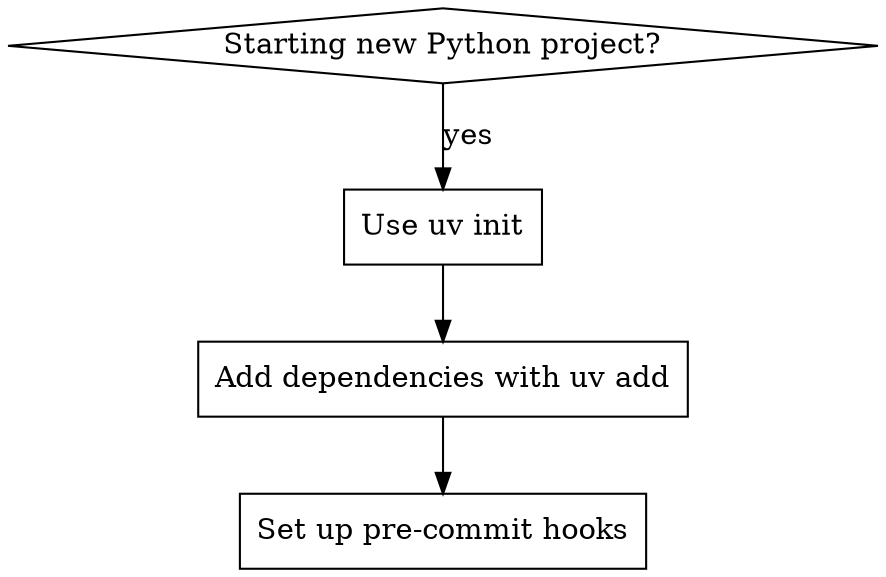
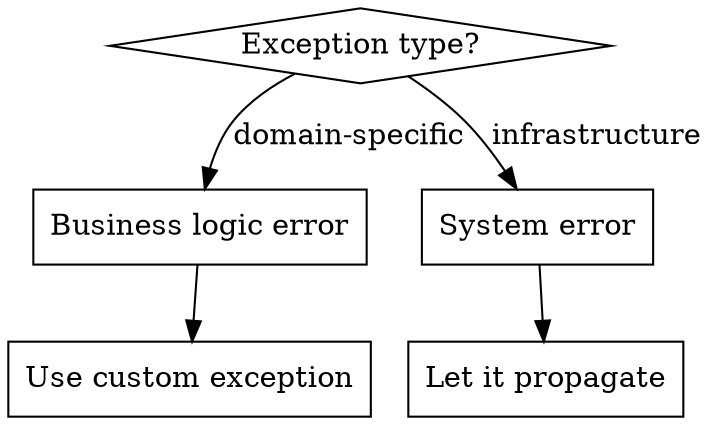

# Python Best Practices

## Overview

**Core principle:** Pythonic code prioritizes readability, maintainability, and leveraging the standard library and modern tooling ecosystem. This skill focuses on advanced patterns that experienced developers need for production-grade Python applications.

**Modern Python Stack Mandate:**
- **Always use Python 3.9+** (ideally 3.11+) for access to modern language features
- **Always use uv** for environment and package management - it's faster and more reliable than pip/venv
- **Always use black** for code formatting - eliminates style debates
- **Always use isort** for import organization - ensures consistent import structure
- **Always use ruff** for linting - fast, Python-native linter that replaces multiple tools
- **Always use pytest** for testing - de facto standard with extensive ecosystem

## Quick Decision Framework

### Project Setup Flowchart


### Exception Handling Strategy


## Quick Reference Tables

### Common Before/After Patterns

| Before (Legacy) | After (Modern) |
|-----------------|----------------|
| `pip install requests && python -m pytest` | `uv add requests pytest && uv run pytest` |
| `if type(x) == str:` | `if isinstance(x, str):` |
| `except Exception:` | `except SpecificException:` |
| Manual dependency management | `uv add package && uv lock` |
| `requirements.txt` manual updates | `uv add/remove` with automatic `pyproject.toml` |

### Tooling Commands

| Task | Command |
|------|---------|
| New project | `uv init project-name` |
| Add dependency | `uv add package-name` |
| Add dev dependency | `uv add --dev pytest` |
| Run tests | `uv run pytest` |
| Format code | `uv run black .` |
| Sort imports | `uv run isort .` |
| Lint code | `uv run ruff check .` |

## When to Dive Deeper

**Go to `development-workflow.md` for:**
- Setting up local development environment
- uv commands and workflows
- IDE configuration

**Go to `code-style.md` for:**
- Type hint patterns and protocols
- Docstring conventions
- Pre-commit hook setup

**Go to `testing-patterns.md` for:**
- pytest fixture patterns
- Test organization strategies
- Coverage and CI integration

**Go to `project-structure.md` for:**
- Module organization principles
- `__init__.py` patterns
- Dependency management strategies

## Core Mental Models

1. **Explicit is better than implicit** - Use type hints, explicit imports, clear interfaces
2. **Leverage the standard library** - Don't reinvent what Python provides
3. **Tooling automation** - Let black/ruff/isort handle consistency automatically
4. **Test-first for critical paths** - Write tests before implementing complex logic
5. **Exception hierarchy** - Create domain-specific exceptions for business logic

## Integration with Superpowers 4.0.0 Skills

### Python-Specific Debugging with systematic-debugging

When debugging Python code, combine systematic-debugging phases with Python tools:

- **Phase 1 (Root Cause)**: Apply systematic methodology, then use Python tools:
  - Exception chains: Use `traceback.print_exc()`, `pdb.post_mortem()`
  - Memory leaks: `objgraph`, `tracemalloc`, `memory_profiler`
  - Performance: `cProfile`, `line_profiler`, `py-spy`

- **Pattern**: systematic-debugging helps identify patterns; Python tools provide specifics

### pytest-TDD Workflow with test-driven-development

Apply RED-GREEN-REFACTOR cycle with Python ecosystem:

- **Framework**: pytest with fixtures and parametrize
- **Property Testing**: Use hypothesis after TDD for edge cases
- **Coverage**: pytest-cov for comprehensive test coverage

Example TDD workflow:
```python
# RED: Write failing test
def test_user_authentication_invalid_password():
    user = User("test@example.com", "correct_password")
    assert not user.authenticate("wrong_password")

# GREEN: Minimal implementation
class User:
    def __init__(self, email, password):
        self.email = email
        self.password = password

    def authenticate(self, password):
        return False  # Always fail - passes test

# REFACTOR: Real implementation
import bcrypt
class User:
    def __init__(self, email, password):
        self.email = email
        self.password_hash = bcrypt.hashpw(password.encode(), bcrypt.gensalt())

    def authenticate(self, password):
        return bcrypt.checkpw(password.encode(), self.password_hash)

# Property-based testing (after TDD)
from hypothesis import given, strategies as st

@given(st.text(min_size=1))
def test_password_properties(password):
    user = User("test@example.com", password)
    assert user.authenticate(password)  # Should always work with original
```

### Anti-Patterns to Avoid

Following `test-driven-development/testing-anti-patterns.md`:

- **Don't test mock behavior**: Test real behavior, not mock interactions
```python
# ❌ BAD: Testing mock
def test_api_call():
    with patch('requests.get') as mock_get:
        mock_get.return_value.json.return_value = {"data": "value"}
        result = fetch_data("http://api.example.com")
        assert result["data"] == "value"  # Testing mock

# ✅ GOOD: Test real or use test server
def test_api_call_integration():
    with TestServer() as server:
        server.add_response("/data", {"data": "value"})
        result = fetch_data(server.url + "/data")
        assert result["data"] == "value"
```

- **No test-only methods**: Keep production code clean
- **Understand dependencies**: Know what you're mocking

## Cross-Reference Index

| Need | Supporting File |
|------|-----------------|
| Environment setup | `development-workflow.md` |
| Code formatting & style | `code-style.md` |
| Testing strategies | `testing-patterns.md` |
| Project structure | `project-structure.md` |
| Error handling patterns | `error-handling.md` |
| Security considerations | `security-patterns.md` |
| Performance optimization | `performance-optimization.md` |
| Code review checklist | `checklists/code-review-checklist.md` |
| Project setup checklist | `checklists/project-setup-checklist.md` |